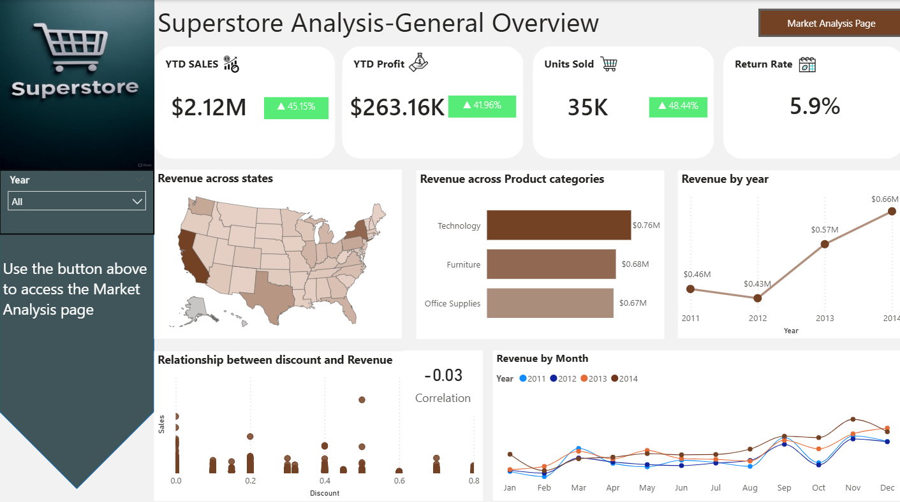
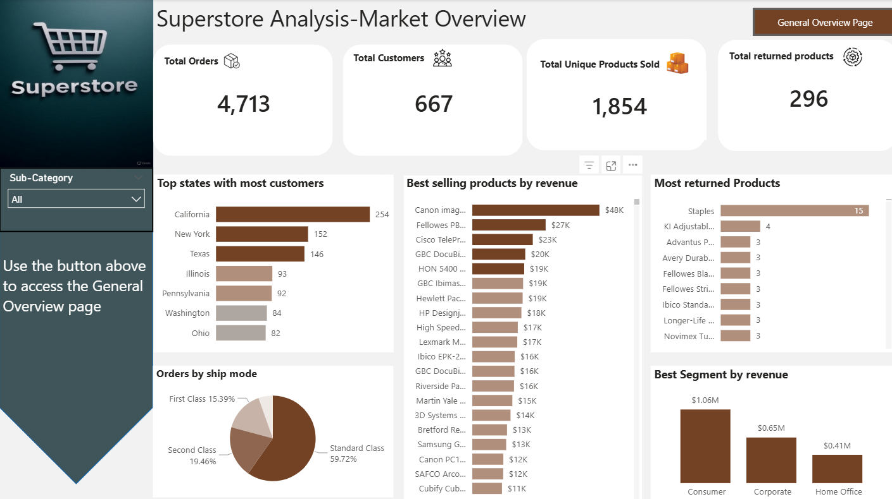

# Superstore Sales Analysis (2011–2014)

📊 **Power BI Report | Business Insights | Executive Summary**

This project analyzes sales and customer performance for a fictional Superstore between 2011 and 2014. It summarizes trends in revenue, customer behavior, product performance, and shipping logistics.

---

## 📸 Dashboard Previews

### 🔹 General Overview

### 🔹 Market Overview

---

## 📁 Project Files

- `Superstore_Sales_Analysis_Presentation.pptx` – Executive-level PowerPoint summary.
- `Superstore_Sales_Analysis_Report.pdf` – Full written report.
- `Superstore_Sales_Analysis_Dashboard.pbix` – Power BI dashboard file.
- `general-overview.png` – Screenshot of the General Overview dashboard.
- `market-overview.png` – Screenshot of the Market Overview dashboard.

---

## 📌 Key Highlights

- **YTD Sales:** $2.12M (↑ 45.15%)
- **Top Product Category:** Technology
- **Top Performing States:** California, New York, Texas
- **Return Rate:** 5.9% (moderate)
- **Best Customer Segment:** Consumer ($1.06M revenue)

---

## 🔍 Insights Extracted

- Weak correlation between discounts and revenue → Revisit pricing strategy
- Q2 & Q4 drive majority of sales → Seasonal trends influence buying
- Standard Class shipping dominates → Opportunity to optimize logistics
- High return for specific products → Need quality control and feedback loop

---

## 📈 Tools Used

- Power BI (Data Analysis & Dashboards)
- Microsoft PowerPoint (Presentation)
- Microsoft Word (Report Formatting)

---

## 🧠 Author

**Jerry Nelson Cobbinah**  
Aspiring Data Analyst | Actuarial Science Graduate  
Tema, Ghana  
📧 [LinkedIn](#) | 📱 0200136829
